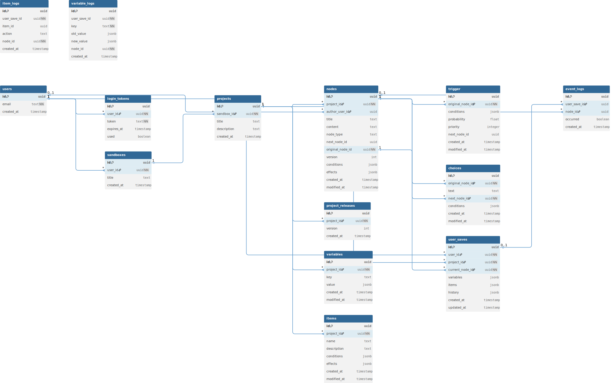

```markdown
# Architecture Documentation

## 📋 목차

- [시스템 개요](#시스템-개요)
- [아키텍처 원칙](#아키텍처-원칙)
- [데이터베이스 스키마](#데이터베이스-스키마)
- [도메인 모델](#도메인-모델)
- [핵심 설계 결정사항](#핵심-설계-결정사항)

---

## 시스템 개요

NarrativeProtagonist는 **노드 기반 인터랙티브 스토리 엔진**입니다.

### 핵심 기능

1. **노드 기반 스토리 구조** - Entry → Scene/Branch → Ending
2. **조건부 분기 시스템** - Variable/Item 기반 conditions
3. **확률 기반 이벤트** - Random Event with probability
4. **버전 관리** - Project Release를 통한 노드 스냅샷
5. **유저 진행 상태** - Save 시스템으로 플레이 세션 관리

### 시스템 구성

```
┌─────────────┐
│   Users     │ - 인증 & 작가 계정
└──────┬──────┘
│
├─────► Sandboxes (작업 공간)
│            │
│            └─► Projects (스토리 프로젝트)
│                     │
│                     ├─► Nodes (스토리 노드)
│                     ├─► Variables (변수)
│                     ├─► Items (아이템)
│                     └─► Project Releases (버전)
│
└─────► User Saves (독자 플레이 상태)
```

---

## 아키텍처 원칙

### 1. 멀티테넌트 설계
- 한 서버에 여러 작가(User)가 각자의 작업 공간(Sandbox) 운영
- Self-hosted / Public Service / Single User 모드 모두 지원

### 2. 버전 관리 중심
- `original_node_id`를 통한 노드 버전 관리
- Project Release로 스냅샷 생성
- 독자는 특정 버전 기준으로 플레이

### 3. 조건-효과(Condition-Effect) 패턴
- **Conditions**: 노드/선택지 활성화 조건
- **Effects**: 노드 실행 시 Variable/Item 변경

### 4. 이벤트 로그 추적
- Event Logs, Variable Logs, Item Logs
- 리플레이, 디버깅, 세이브 복원 지원

---

## 데이터베이스 스키마

### ERD 다이어그램



---

## 도메인 모델

### 1️⃣ Users & Auth

플랫폼 사용자 정보와 인증.

#### **users**
| 컬럼 | 타입 | 설명 |
|------|------|------|
| `id` | UUID | PK |
| `email` | TEXT | 로그인 이메일 (UNIQUE) |
| `created_at` | TIMESTAMP | 생성 시각 |

#### **login_tokens**
로그인을 위한 일회성 토큰 (Magic Link 방식).

| 컬럼 | 타입 | 설명 |
|------|------|------|
| `id` | UUID | PK |
| `user_id` | UUID | FK → users.id |
| `token` | TEXT | 고유 토큰 (UNIQUE) |
| `expires_at` | TIMESTAMP | 만료 시간 |
| `used` | BOOLEAN | 사용 여부 |

---

### 2️⃣ Sandbox & Projects

작가가 여러 프로젝트를 관리할 수 있는 워크스페이스 구조.

#### **sandboxes**
사용자별 작업 공간.

| 컬럼 | 타입 | 설명 |
|------|------|------|
| `id` | UUID | PK |
| `user_id` | UUID | FK → users.id |
| `title` | TEXT | 샌드박스 이름 |
| `created_at` | TIMESTAMP | 생성 시각 |

**특징:**
- 한 유저당 하나의 Sandbox (1:1 관계)
- Sandbox 안에 여러 Project 생성 가능

#### **projects**
하나의 독립된 스토리 프로젝트.

| 컬럼 | 타입 | 설명 |
|------|------|------|
| `id` | UUID | PK |
| `sandbox_id` | UUID | FK → sandboxes.id |
| `title` | TEXT | 프로젝트명 |
| `description` | TEXT | 설명 |
| `created_at` | TIMESTAMP | 생성 시각 |

#### **project_releases**
프로젝트의 버전 관리 시스템.

| 컬럼 | 타입 | 설명 |
|------|------|------|
| `id` | UUID | PK |
| `project_id` | UUID | FK → projects.id |
| `version` | INTEGER | 릴리스 버전 번호 |
| `created_at` | TIMESTAMP | 릴리스 시각 |

**동작 방식:**
1. 작가가 "Publish" 버튼 클릭
2. 현재 모든 노드의 스냅샷 생성
3. `project_releases` 레코드 생성
4. 독자는 특정 릴리스 버전 기준으로 플레이

---

### 3️⃣ Nodes (스토리의 핵심)

노드는 스토리의 **장면(Scene)** 또는 **이벤트(Event)**를 의미.

#### **nodes**
| 컬럼 | 타입 | 설명 |
|------|------|------|
| `id` | UUID | PK (버전 포함된 실제 ID) |
| `project_id` | UUID | FK → projects.id |
| `author_user_id` | UUID | FK → users.id |
| `title` | TEXT | 노드 제목 |
| `content` | TEXT | 본문 텍스트 |
| `node_type` | TEXT | `START` / `STORY` / `EVENT` / `RANDOM_EVENT` |
| `next_node_id` | UUID | 다음 노드 (STORY/START용) |
| `original_node_id` | UUID | **원본 노드 ID** (버전 공유) |
| `version` | INTEGER | 노드 버전 번호 |
| `conditions` | JSONB | 노드 실행 조건 |
| `effects` | JSONB | 노드 실행 후 효과 |
| `created_at` | TIMESTAMP | 생성 시각 |
| `modified_at` | TIMESTAMP | 수정 시각 |

#### 🔑 왜 `original_node_id`가 필요한가?

**문제 상황:**
- 작가가 노드를 수정하면 새 버전이 생성됨
- 다른 노드들이 참조하는 ID가 바뀌면 연결이 깨짐

**해결 방법:**
- 모든 노드는 `original_node_id`를 가짐 (버전이 바뀌어도 동일)
- 다른 노드의 `next_node_id`, `choices.next_node_id`는 `original_node_id`를 참조
- 버전이 바뀌어도 스토리 연결 유지

**예시:**
```
Node A (original_id: node-001, version: 1)
→ next_node_id: node-002 (original 참조)

Node B를 수정 (original_id: node-002, version: 2로 증가)

Node A는 여전히 node-002를 참조하므로 연결 유지 ✅
```

#### Node Type 설명

| Type | 설명 | 특징 |
|------|------|------|
| `START` | 스토리 시작 노드 | 프로젝트당 1개, `next_node_id` 보유 |
| `STORY` | 일반 장면 | 자동으로 다음 노드로 진행, `next_node_id` 보유 |
| `EVENT` | 선택지 분기 | `choices` 테이블로 분기 정의 |
| `RANDOM_EVENT` | 확률 기반 이벤트 | `trigger` 테이블로 확률 분기 |

---

### 4️⃣ Trigger (자동 이벤트 분기)

`RANDOM_EVENT` 노드에서 사용되는 확률 기반 분기.

#### **trigger**
| 컬럼 | 타입 | 설명 |
|------|------|------|
| `id` | UUID | PK |
| `original_node_id` | UUID | FK → nodes.original_node_id |
| `conditions` | JSONB | 조건 (없으면 항상 true) |
| `probability` | FLOAT | 확률 (0~1, 예: 0.2 = 20%) |
| `priority` | INTEGER | 트리거 충돌 시 우선순위 |
| `next_node_id` | UUID | 이동할 노드 (original 기준) |
| `created_at` | TIMESTAMP | 생성 시각 |
| `modified_at` | TIMESTAMP | 수정 시각 |

**사용 예시:**

```json
{
  "original_node_id": "forest-scene",
  "conditions": { "health": { "$lte": 30 } },
  "probability": 0.3,
  "next_node_id": "bandit-encounter"
}
```
→ 체력 30% 이하일 때, 30% 확률로 강도 등장

---

### 5️⃣ Choices (선택지 기반 분기)

`EVENT` 노드에서 사용자가 선택할 수 있는 옵션.

#### **choices**
| 컬럼 | 타입 | 설명 |
|------|------|------|
| `id` | UUID | PK |
| `original_node_id` | UUID | FK → nodes.original_node_id |
| `text` | TEXT | 선택지 텍스트 |
| `next_node_id` | UUID | 선택 시 이동할 노드 (original 기준) |
| `conditions` | JSONB | 선택지 활성화 조건 |
| `created_at` | TIMESTAMP | 생성 시각 |
| `modified_at` | TIMESTAMP | 수정 시각 |

**사용 예시:**

```json
[
  {
    "text": "담을 넘는다",
    "next_node_id": "climb-wall",
    "conditions": { "stamina": { "$gte": 50 } }
  },
  {
    "text": "정문으로 간다",
    "next_node_id": "main-gate",
    "conditions": null
  }
]
```

---

### 6️⃣ Variables & Items

스토리 로직 동작을 위한 상태 데이터.

#### **variables**
프로젝트 공용 변수.

| 컬럼 | 타입 | 설명 |
|------|------|------|
| `id` | UUID | PK |
| `project_id` | UUID | FK → projects.id |
| `key` | TEXT | 변수명 (예: `health`, `affection`) |
| `value` | JSONB | 초기값 |
| `created_at` | TIMESTAMP | 생성 시각 |
| `modified_at` | TIMESTAMP | 수정 시각 |

**예시:**
```json
{ "key": "health", "value": 100 }
{ "key": "weather", "value": "sunny" }
```

#### **items**
아이템 정보.

| 컬럼 | 타입 | 설명 |
|------|------|------|
| `id` | UUID | PK |
| `project_id` | UUID | FK → projects.id |
| `name` | TEXT | 아이템명 |
| `description` | TEXT | 설명 |
| `conditions` | JSONB | 사용 조건 |
| `effects` | JSONB | 사용 효과 |
| `created_at` | TIMESTAMP | 생성 시각 |
| `modified_at` | TIMESTAMP | 수정 시각 |

**예시:**
```json
{
  "name": "Health Potion",
  "description": "체력을 50 회복",
  "effects": { "health": { "$add": 50 } }
}
```

---

### 7️⃣ Logs (이벤트 추적)

유저 플레이 중 발생한 내역을 기록.

#### **event_logs**
어떤 이벤트 노드가 발생했는지 기록.

| 컬럼 | 타입 | 설명 |
|------|------|------|
| `id` | UUID | PK |
| `user_save_id` | UUID | FK → user_saves.id |
| `node_id` | UUID | FK → nodes.id |
| `occurred` | BOOLEAN | 발생 여부 |
| `created_at` | TIMESTAMP | 발생 시각 |

#### **variable_logs**
변수 변경 기록.

| 컬럼 | 타입 | 설명 |
|------|------|------|
| `id` | UUID | PK |
| `user_save_id` | UUID | FK → user_saves.id |
| `key` | TEXT | 변수명 |
| `old_value` | JSONB | 변경 전 값 |
| `new_value` | JSONB | 변경 후 값 |
| `node_id` | UUID | FK → nodes.id |
| `created_at` | TIMESTAMP | 변경 시각 |

#### **item_logs**
아이템 획득/삭제 기록.

| 컬럼 | 타입 | 설명 |
|------|------|------|
| `id` | UUID | PK |
| `user_save_id` | UUID | FK → user_saves.id |
| `item_id` | UUID | FK → items.id |
| `action` | TEXT | `ADD` / `REMOVE` / `UPDATE` |
| `node_id` | UUID | FK → nodes.id |
| `created_at` | TIMESTAMP | 발생 시각 |

---

### 8️⃣ Saves (유저 진행 상태)

독자가 스토리를 플레이하는 세션 정보.

#### **user_saves**
| 컬럼 | 타입 | 설명 |
|------|------|------|
| `id` | UUID | PK |
| `user_id` | UUID | FK → users.id |
| `project_id` | UUID | FK → projects.id |
| `current_node_id` | UUID | 현재 위치한 노드 |
| `variables` | JSONB | 현재 변수 상태 |
| `items` | JSONB | 현재 인벤토리 |
| `history` | JSONB | 지나온 노드 목록 |
| `created_at` | TIMESTAMP | 세션 시작 시각 |
| `updated_at` | TIMESTAMP | 마지막 플레이 시각 |

**예시:**
```json
{
  "current_node_id": "castle-entrance",
  "variables": {
    "health": 75,
    "gold": 1200,
    "reputation": "neutral"
  },
  "items": ["sword", "health_potion", "old_key"],
  "history": ["start", "village", "forest", "castle-entrance"]
}
```

---

## 핵심 설계 결정사항

### 1. 왜 UUID를 사용하는가?

**이유:**
- 분산 시스템에서 ID 충돌 방지
- 노드 복사/이동 시 유리
- 버전 관리 시 명확한 식별

### 2. 왜 JSONB를 사용하는가?

**사용처:**
- `conditions`, `effects`, `variables`, `items`

**이유:**
- 유연한 스키마 (프로젝트마다 다른 변수/아이템 정의 가능)
- PostgreSQL의 강력한 JSONB 쿼리 지원
- 향후 확장 용이

**예시 쿼리:**
```sql
-- health가 50 이상인 세이브 찾기
SELECT * FROM user_saves 
WHERE variables->>'health' >= '50';

-- 특정 아이템을 가진 세이브 찾기
SELECT * FROM user_saves 
WHERE items ? 'magic_sword';
```

### 3. 버전 관리 전략

**문제:**
- 작가가 노드를 수정하면 기존 독자의 진행에 영향

**해결:**
- `original_node_id`로 논리적 노드 식별
- 실제 `id`는 버전별로 다름
- Project Release로 스냅샷 생성
- 독자는 특정 릴리스 버전 기준으로 플레이

**시나리오:**
```
1. 작가가 프로젝트 v1 릴리스
   → 독자 A가 v1으로 플레이 시작

2. 작가가 노드 수정 후 v2 릴리스
   → 독자 A는 계속 v1으로 플레이
   → 신규 독자 B는 v2로 플레이

3. 두 독자의 경험이 독립적으로 유지됨 ✅
```

### 4. Conditions & Effects 구조

**Conditions (조건):**
```json
{
  "health": { "$gte": 50 },
  "hasItem": { "$eq": "sword" },
  "reputation": { "$in": ["hero", "legend"] }
}
```

**Effects (효과):**
```json
{
  "health": { "$add": -10 },
  "gold": { "$set": 0 },
  "items": { "$add": ["old_key"], "$remove": ["broken_sword"] }
}
```

**연산자:**
- `$eq`, `$ne` - 같음/다름
- `$gt`, `$gte`, `$lt`, `$lte` - 비교
- `$in`, `$nin` - 포함/미포함
- `$add`, `$sub`, `$set` - 연산

---

## 시스템 흐름

### 독자 플레이 시나리오

```
1. 독자가 프로젝트 시작
   ↓
2. user_saves 레코드 생성
   - current_node_id: START 노드
   - variables: 프로젝트 초기값 복사
   - items: 빈 배열
   ↓
3. 노드 렌더링
   - node.conditions 체크
   - content 표시
   - effects 실행 (variable/item 변경)
   ↓
4-a. STORY 노드 → next_node_id로 자동 이동
4-b. EVENT 노드 → choices 중 선택
4-c. RANDOM_EVENT → trigger 확률 계산 후 분기
   ↓
5. user_saves 업데이트
   - current_node_id 갱신
   - variables, items 갱신
   - history에 노드 추가
   ↓
6. Logs 기록 (event_logs, variable_logs, item_logs)
   ↓
7. 3번으로 돌아가 반복
```

---

## 확장 가능성

### 향후 추가 고려 중인 기능

1. **Analytics**
    - 어떤 선택지가 많이 선택되는지 통계
    - `choice_analytics` 테이블 추가
    - 
2. **Achievements**
    - 특정 조건 달성 시 뱃지 획득
    - `achievements` 테이블 추가

3. **Dynamic Dialogue**
    - 변수 기반 대사 변경
    - `content`에 템플릿 문법 지원

---

## 기술 스택 매핑

| 레이어 | 기술 | 역할 |
|--------|------|------|
| **Domain** | Kotlin + JPA | Entity 정의 |
| **Persistence** | PostgreSQL + Flyway | 데이터 저장 & 마이그레이션 |
| **API** | Spring Web | REST API |
| **Auth** | Spring Security + JWT | 인증/인가 |
| **Logic** | Kotlin DSL | Conditions/Effects 평가 엔진 |

---

## 참고 자료

- [README.md](../README.md) - 프로젝트 개요
- [API Documentation](API.md) - 엔드포인트 명세 (예정)
- [Setup Guide](SETUP.md) - 개발 환경 구축 (예정)

---

**이 아키텍처는:**
- 노드 기반 스토리 구조
- 조건/확률 기반 분기
- 변수/아이템 상태 관리
- 유저별 진행 세이브
- 버전 관리

**까지 포함하는 완전한 인터랙티브 스토리 엔진을 구성합니다.**

노드(`original_node_id`) 기반 참조를 통해 프로젝트를 업데이트하거나 재출시할 때도 스토리 링크가 깨지지 않도록 설계되었습니다.
